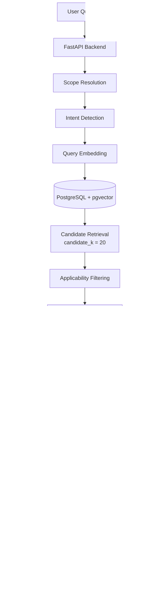
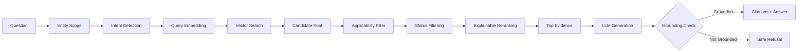
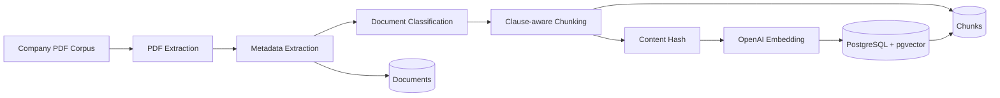
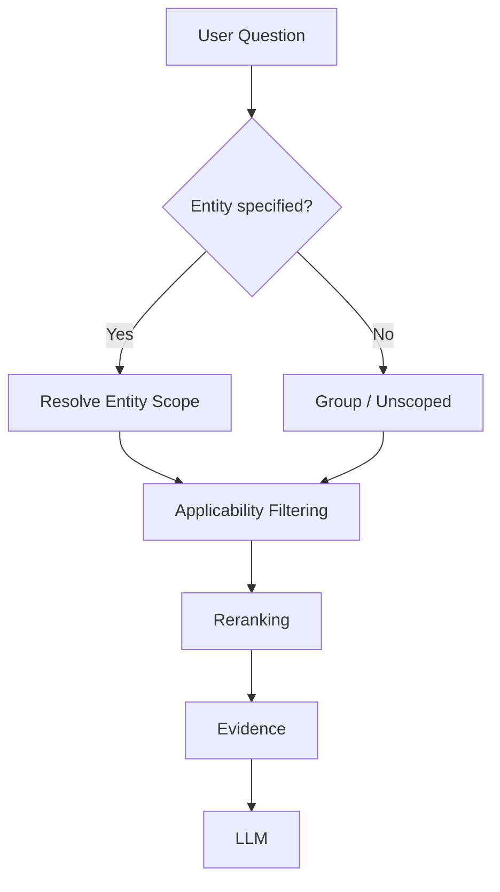
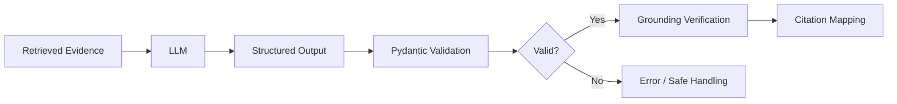
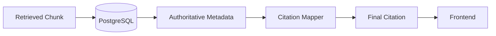
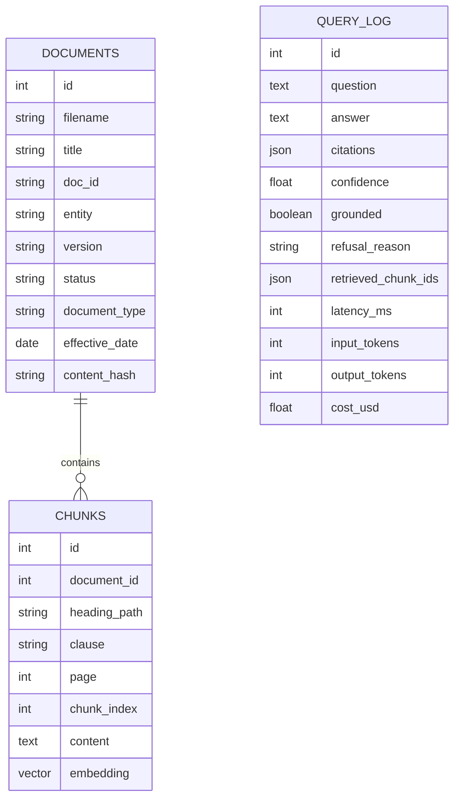
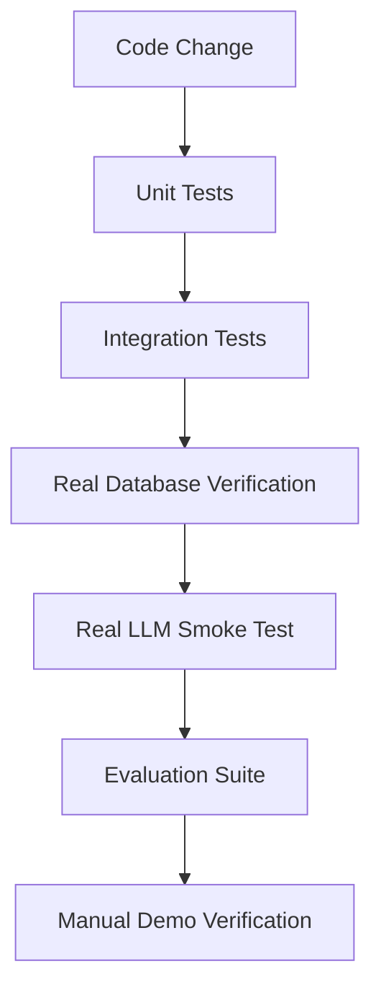
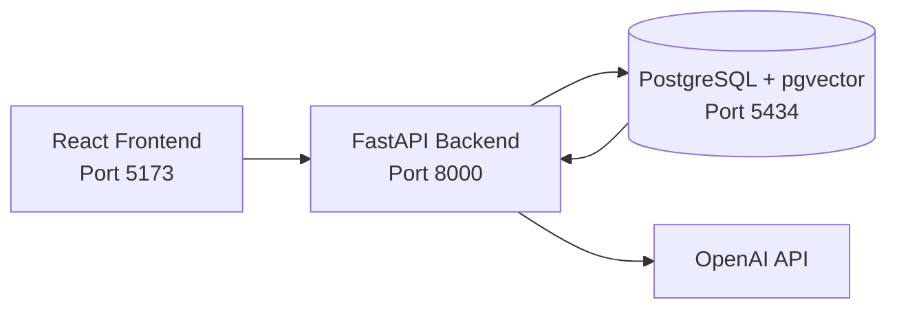
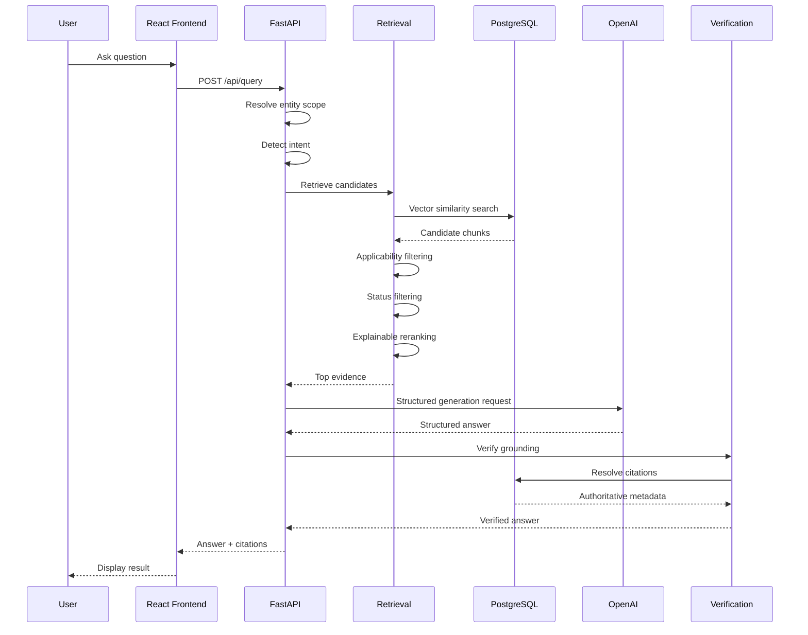

# 🛡️ Compliance Copilot

> **Evidence-grounded compliance question answering using RAG, PostgreSQL + pgvector, entity-aware retrieval, explainable reranking, grounding verification, and database-backed citations.**

Compliance Copilot is an end-to-end Retrieval-Augmented Generation (RAG) system designed to answer questions from a controlled corpus of company compliance and policy documents.

Instead of relying only on an LLM's general knowledge, the system retrieves relevant evidence from the provided documents, applies applicability and status rules, reranks the evidence, generates a structured answer, verifies grounding, and maps citations back to the underlying database records.

The system is designed around an important principle:

> **If the provided evidence does not support an answer, the system should refuse rather than invent one.**

---

## 📌 Table of Contents

- [Overview](#-overview)
- [Problem Statement](#-problem-statement)
- [Project Goals](#-project-goals)
- [System Architecture](#️-system-architecture)
- [RAG Query Pipeline](#-rag-query-pipeline)
- [Document Ingestion Pipeline](#-document-ingestion-pipeline)
- [Core Components](#-core-components)
- [Retrieval and Ranking](#-retrieval-and-ranking)
- [Entity Applicability](#-entity-applicability)
- [Current vs Superseded Documents](#-current-vs-superseded-documents)
- [Grounding and Safe Refusal](#-grounding-and-safe-refusal)
- [Citation Architecture](#-citation-architecture)
- [LLM Architecture](#-llm-architecture)
- [Database Design](#️-database-design)
- [Project Structure](#-project-structure)
- [Technology Stack](#-technology-stack)
- [Corpus](#-corpus)
- [Evaluation](#-evaluation)
- [Verified Results](#-verified-results)
- [Example Questions](#-example-questions)
- [Running the Project](#-running-the-project)
- [Environment Variables](#-environment-variables)
- [API](#-api)
- [Testing](#-testing)
- [Docker Architecture](#-docker-architecture)
- [Known Limitations](#️-known-limitations)
- [Future Improvements](#-future-improvements)
- [Design Decisions](#-design-decisions)
- [Security](#-security)
- [Interview Talking Points](#-interview-talking-points)
- [Author](#-author)

---

# 🔎 Overview

Compliance Copilot processes a controlled set of company policy documents and exposes a question-answering interface.

The high-level flow is:

```text
Company PDFs
     │
     ▼
Document Extraction
     │
     ▼
Metadata + Clause-aware Chunking
     │
     ▼
OpenAI Embeddings
     │
     ▼
PostgreSQL + pgvector
     │
     ▼
User Question
     │
     ▼
Entity + Intent Resolution
     │
     ▼
Vector Retrieval
     │
     ▼
Applicability Filtering
     │
     ▼
Explainable Reranking
     │
     ▼
Evidence Selection
     │
     ▼
OpenAI GPT-4o-mini
     │
     ▼
Grounding Verification
     │
     ▼
Database-backed Citations
     │
     ▼
Answer or Safe Refusal
```

The project separates:

- **Ingestion**
- **Retrieval**
- **Applicability**
- **Reranking**
- **Generation**
- **Verification**
- **Citation mapping**
- **Evaluation**

This makes the system easier to test, reason about, and improve independently.

---

# 🎯 Problem Statement

Compliance questions often require precise answers from internal policies rather than generic language-model knowledge.

For example:

> How long must KYC records be retained?

A generic LLM may produce a plausible answer from its prior knowledge.

A compliance assistant should instead determine:

1. Which documents are relevant?
2. Which entity does the requirement apply to?
3. Is the document current or superseded?
4. Does another governing document override the general policy?
5. Is there enough evidence to answer?
6. Can the final answer be traced back to the source?

Compliance Copilot addresses these requirements through a controlled RAG pipeline.

---

# 🎯 Project Goals

The system was designed to provide:

- Evidence-grounded answers
- Entity-aware policy retrieval
- Current-policy preference
- Historical/superseded-document handling
- Explainable reranking
- Structured LLM output
- Grounding verification
- Database-backed citations
- Safe refusal when evidence is insufficient
- Idempotent document ingestion
- Query logging and cost tracking
- Reproducible Docker-based deployment
- Automated testing and evaluation

---

# 🏗️ System Architecture



---

# 🔄 RAG Query Pipeline

Each question passes through multiple controlled stages.



---

# 📥 Document Ingestion Pipeline

The project processes a corpus of company-provided PDF documents.



The ingestion pipeline extracts and stores:

- Document ID
- Filename
- Title
- Entity
- Version
- Status
- Status note
- Effective date
- Document type
- Content hash
- Heading path
- Clause
- Page
- Chunk content
- Embedding

---

# 📊 Current Corpus

The current project corpus contains:

| Metric | Value |
|---|---:|
| Company PDF documents | **26** |
| Document chunks | **983** |
| Chunks with embeddings | **983** |
| Current documents | **25** |
| Superseded documents | **1** |

Document types include:

- Policy
- Entity-specific policy
- Procedure
- Guidance
- Regulatory document

---

# 🧩 Core Components

## 1. Document Extraction

Responsible for extracting text and metadata from the PDF corpus.

Key responsibilities:

- PDF text extraction
- Front-matter metadata extraction
- Document identification
- Version/status extraction
- Effective-date extraction

---

## 2. Clause-aware Chunking

Instead of splitting documents into arbitrary fixed-size blocks, the ingestion pipeline preserves policy structure where possible.

Examples include:

- Section headings
- Clauses
- Lettered clauses
- Annexures
- Page information

This improves traceability and citation quality.

---

## 3. Embedding

Document chunks are converted into vector representations using OpenAI embeddings.

The current database uses:

```text
vector(384)
```

The embedding model is configured around:

```text
text-embedding-3-small
```

---

## 4. PostgreSQL + pgvector

PostgreSQL stores both structured metadata and vector embeddings.

The project uses:

```text
PostgreSQL
+
pgvector
```

This allows semantic retrieval while retaining normal relational database capabilities.

---

# 🔍 Retrieval and Ranking

Retrieval intentionally happens in stages.

The system does not immediately retrieve only five chunks.

Instead:

```text
Vector Retrieval
      │
      ▼
candidate_k = 20
      │
      ▼
Applicability Filtering
      │
      ▼
Status Handling
      │
      ▼
Explainable Reranking
      │
      ▼
top_k = 5
```

This gives the system a larger initial evidence pool before selecting the final context.

---

# 📈 Explainable Reranking

The reranker combines multiple signals rather than using a simplistic document hierarchy.

The current design considers:

- Entity applicability
- Document status
- Authority/document type
- Semantic similarity
- Clause characteristics

The architecture intentionally avoids a hard rule such as:

```text
POLICY > SOP > GUIDANCE
```

because the correct governing evidence may sometimes exist in a procedure or regulatory document.

Instead, document authority acts as a controlled signal rather than an absolute hierarchy.

---

# 🏢 Entity Applicability

The corpus contains both group-level and entity-specific requirements.

For example, a group policy may state one retention period while a subsidiary policy specifies another.

The system therefore resolves an answering scope.

Conceptually:



When an entity is explicitly selected through the API/UI, that scope is also communicated to the generation layer.

This prevents the model from incorrectly interpreting an API-selected entity as if no entity had been specified.

---

# 🕐 Current vs Superseded Documents

Superseded documents are normally excluded from ordinary current-policy retrieval.

For historical questions, the system can explicitly allow superseded evidence.

Conceptually:

```text
Current Question
      │
      ▼
Current Documents
      │
      ▼
Answer

Historical Question
      │
      ▼
Current + Superseded Evidence
      │
      ▼
Historical Answer
```

This prevents outdated policy requirements from accidentally appearing in normal answers.

For example, the corpus contains:

```text
Current breach requirement:
4 hours

Superseded requirement:
8 hours
```

The normal current-policy path should use the four-hour requirement.

A historical query should explicitly request the previous requirement.

---

# 🧠 Intent Detection

The system distinguishes between current and historical intent.

Examples:

```text
"What is the breach reporting requirement?"
```

→ Current intent

```text
"What did the breach policy previously require?"
```

→ Historical intent

Historical intent changes the retrieval policy so that superseded documents may become eligible.

---

# 🏛️ Governing Evidence

Some policy questions involve a governing schedule or specialized document that takes precedence over a general policy.

For example, a general policy may state:

```text
7 years
```

while a financial-record schedule may specify:

```text
8 years
```

The system therefore supports governing evidence for retention-related questions.

The design is intentionally cautious about hardcoding document-specific behaviour.

The longer-term architectural direction is to represent governing relationships as explicit metadata rather than relying on document IDs.

---

# 🤖 LLM Architecture

The generation layer is provider-isolated behind a provider-neutral generation result.

Current provider:

```text
OpenAI
```

Current generation model:

```text
gpt-4o-mini
```

The LLM receives:

- User question
- Resolved scope
- Intent
- Retrieved evidence
- Evidence metadata
- Instructions for structured output

The model is instructed to answer only from the supplied evidence.

---

# 📦 Structured Output

The generation layer does not simply accept arbitrary free-form text.

The LLM produces structured answer information that is validated before being returned.

Conceptually:



This makes downstream processing deterministic.

---

# 🛡️ Grounding and Safe Refusal

One of the core design principles is:

> **Do not answer when the evidence does not support the answer.**

The system can return a safe refusal:

```text
I don't know based on the provided documents.
```

A refusal is recorded with machine-readable metadata such as:

```text
grounded = false
refusal_reason = model_declined
```

This is preferable to producing an unsupported compliance statement.

---

# 🔗 Citation Architecture

Citations are database-authoritative.

The LLM does not get to invent:

- Document IDs
- Clause numbers
- Pages
- Versions
- Status
- Source metadata

Instead:



A citation can therefore be traced back to:

```text
Document
   ↓
Chunk
   ↓
Clause
   ↓
Page
   ↓
Version
   ↓
Status
```

This improves auditability and trust.

---

# 💾 Database Design

The main database tables are:

```text
documents
chunks
query_log
```

## Documents

Stores document-level metadata.

Important fields include:

```text
id
filename
title
doc_id
entity
version
status
status_note
effective_date
document_type
content_hash
created_at
```

## Chunks

Stores chunk-level evidence.

Important fields include:

```text
id
document_id
heading_path
clause
page
chunk_index
content
embedding
created_at
```

## Query Log

Stores query execution information.

Important fields include:

```text
id
question
answer
citations
confidence
grounded
refusal_reason
retrieved_chunk_ids
latency_ms
input_tokens
output_tokens
cost_usd
created_at
```

---

# 🗄️ PostgreSQL + pgvector

The project uses pgvector for semantic search.

Current vector configuration:

```text
Extension: vector
Version: 0.5.1

Embedding column:
chunks.embedding

Vector dimension:
384
```

Database architecture:



---

# 📁 Project Structure

```text
compliance-copilot/
│
├── backend/
│   ├── app/
│   │   ├── api/
│   │   │   └── routes/
│   │   │       ├── health.py
│   │   │       ├── ingestion.py
│   │   │       └── query.py
│   │   │
│   │   ├── citations/
│   │   │   └── mapper.py
│   │   │
│   │   ├── ingestion/
│   │   │   ├── chunker.py
│   │   │   ├── embedder.py
│   │   │   ├── extractor.py
│   │   │   └── pipeline.py
│   │   │
│   │   ├── query/
│   │   │   ├── applicability.py
│   │   │   ├── governing.py
│   │   │   ├── pipeline.py
│   │   │   └── reranker.py
│   │   │
│   │   ├── confidence.py
│   │   ├── config.py
│   │   ├── init.sql
│   │   ├── llm.py
│   │   ├── main.py
│   │   ├── models.py
│   │   ├── retrieval.py
│   │   ├── schemas.py
│   │   └── verification.py
│   │
│   ├── scripts/
│   │   └── run_ingest.py
│   │
│   └── tests/
│       ├── api/
│       ├── ingestion/
│       ├── query/
│       └── retrieval/
│
├── frontend/
│   └── src/
│       ├── components/
│       │   ├── AnswerCard.jsx
│       │   ├── CitationList.jsx
│       │   ├── ConfidenceIndicator.jsx
│       │   ├── EntitySelector.jsx
│       │   ├── QuestionInput.jsx
│       │   └── RefusalMessage.jsx
│       │
│       └── services/
│           └── api.js
│
├── eval/
│   ├── eval.py
│   ├── questions.yaml
│   └── requirements.txt
│
├── docs/
│   └── company-provided PDF corpus
│
├── docs_sample_fabricated/
│   └── sample documents
│
├── CORPUS_README.md
├── CURRENT_STATUS.md
├── DEMO.md
├── DESIGN.md
├── INTERVIEW.md
├── README.md
├── docker-compose.yml
├── .env.example
└── .gitignore
```

---

# 🛠️ Technology Stack

## Backend

- Python
- FastAPI
- Pydantic
- SQLAlchemy
- Pytest

## Database

- PostgreSQL
- pgvector

## AI / RAG

- OpenAI embeddings
- OpenAI GPT-4o-mini
- Vector similarity search
- Entity-aware retrieval
- Explainable reranking
- Structured generation
- Grounding verification

## Frontend

- React
- Vite
- JavaScript / JSX

## Infrastructure

- Docker
- Docker Compose

---

# 📚 Corpus

The project uses a controlled corpus of company-provided policy documents.

The current corpus contains:

```text
26 PDFs
983 chunks
983 embeddings
```

The corpus includes multiple document families such as:

```text
NFS-POL-*
NFS-SUB-*
NFS-SOP-*
NFS-GUID-*
NFS-REG-*
```

The PDF corpus itself is intentionally excluded from Git because it is external/company-provided data.

---

# 🧪 Evaluation

The project contains a dedicated evaluation suite.

Evaluation questions cover areas such as:

- Current policy retrieval
- Entity-specific requirements
- Historical requirements
- Retention requirements
- Governing documents
- Applicability
- Abstention/refusal
- Citation correctness

Evaluation should be treated as a separate correctness layer from unit testing.

---

# ✅ Verified Results

The backend test suite has reached:

```text
205 passed
0 failed
```

The live database has been verified with:

```text
documents = 26
chunks = 983
embeddings = 983
```

The real OpenAI generation path has also been exercised successfully.

Example live query:

```text
How quickly must a breach be reported to the DPO?
```

The system returned the current requirement:

```text
Four (4) hours
```

and correctly avoided citing the superseded eight-hour policy in the normal current-policy path.

---

# 💰 Query Logging and Cost Tracking

Each query can record:

- Input tokens
- Output tokens
- Cost
- Latency
- Confidence
- Grounded status
- Refusal reason
- Retrieved chunk IDs
- Citations

Example:

```text
grounded = true
confidence = 0.95
input_tokens = ...
output_tokens = ...
cost_usd = ...
latency_ms = ...
```

This provides visibility into both correctness and operational cost.

---

# 🧑‍💻 Example Questions

## Current requirement

```text
How quickly must a breach be reported to the DPO?
```

Expected current-policy behaviour:

```text
Four (4) hours
```

---

## Entity-specific requirement

```text
How long must KYC records be retained?
```

with:

```text
Entity = Northwind Capital Markets Ltd
```

Expected:

```text
Seven (7) years
```

---

## Group-level requirement

```text
How long must KYC records be retained?
```

with group scope.

Expected:

```text
Five (5) years
```

---

## Insufficient evidence

```text
What monthly stipend is paid for home internet?
```

Expected behaviour:

```text
I don't know based on the provided documents.
```

---

# 🚀 Running the Project

## 1. Clone the repository

```bash
git clone git@github.com:San7122/Compliance-Copilot.git
cd Compliance-Copilot
```

---

## 2. Create environment file

```bash
cp .env.example .env
```

Add the required API configuration to `.env`.

Do **not** commit `.env`.

---

## 3. Start the database

```bash
docker compose up -d db
```

---

## 4. Start the backend

```bash
docker compose up -d backend
```

The backend startup process is designed so ingestion is idempotent.

---

## 5. Start the frontend

```bash
docker compose up -d frontend
```

---

## 6. Check services

```bash
docker compose ps
```

Expected services:

```text
db
backend
frontend
```

---

# 🔌 Local URLs

Frontend:

```text
http://localhost:5173
```

Backend:

```text
http://localhost:8000
```

Health endpoint:

```text
http://localhost:8000/health
```

---

# 🔑 Environment Variables

Use `.env.example` as the template.

Typical configuration includes:

```text
POSTGRES_USER
POSTGRES_PASSWORD
POSTGRES_DB
POSTGRES_HOST_PORT

EMBEDDING_API_KEY

LLM_API_KEY

EMBEDDING_MODEL
EMBEDDING_DIMENSIONS

TOP_K
CANDIDATE_K
MIN_SIMILARITY
```

Secrets should remain in `.env`.

The repository should contain only safe placeholders in `.env.example`.

---

# 🌐 API

## Health

```http
GET /health
```

Example response:

```json
{
  "status": "ok"
}
```

---

## Query

```http
POST /api/query
```

Conceptually:

```json
{
  "question": "How long must KYC records be retained?",
  "entity": "Northwind Capital Markets Ltd"
}
```

The response contains:

- Answer
- Confidence
- Grounded status
- Citations
- Refusal information when applicable

---

## Ingestion

```http
POST /api/ingest
```

The ingestion process is designed to be idempotent using content hashing.

---

## Query History

```http
GET /api/history
```

Query history is backed by the `query_log` database table.

---

# 🧪 Testing

Run the backend test suite:

```bash
cd backend
pytest tests -q
```

Current verified baseline:

```text
205 passed
0 failed
```

The tests cover:

```text
Ingestion
Retrieval
Applicability
Reranking
Entity scope
Governing evidence
LLM integration
Citation mapping
Grounding
Confidence
API behaviour
```

---

# 📊 Testing Strategy

The project uses multiple testing layers.



This distinction is important because mocked tests cannot prove that a real LLM will interpret a prompt exactly as expected.

---

# 🐳 Docker Architecture



Docker Compose manages the three primary local services:

```text
frontend
backend
db
```

---

# 🔐 Security and Data Handling

The project intentionally avoids committing sensitive information.

Excluded from Git:

```text
.env
API keys
Company-provided PDFs
.DS_Store
Python caches
Virtual environments
```

The company PDF corpus is treated as external data and is not included in the repository.

---

# ⚠️ Known Limitations

## 1. Historical retrieval

Historical intent handling is implemented, but a historical breach-policy query has exposed a retrieval limitation where the superseded document may fail to enter the vector candidate set.

The system fails safely in that situation by refusing instead of inventing an answer.

This remains an area for further improvement.

---

## 2. Retrieval redundancy

The current reranking strategy can sometimes select multiple highly similar chunks from related documents.

This can reduce evidence diversity.

A future improvement would be a more general evidence-diversity strategy.

---

## 3. Governing-document logic

Retention-related governing evidence is supported.

The longer-term architecture should represent governing relationships as explicit metadata rather than relying on corpus-specific document identification.

---

## 4. Confidence calibration

The current confidence value is useful as a system signal but is not yet statistically calibrated against a large labelled evaluation set.

---

## 5. Intent detection

Historical intent detection currently relies on explicit language patterns.

Unusual historical wording may not always be detected.

---

## 6. Frontend

The frontend is implemented in JSX rather than TypeScript.

A future version could introduce stronger compile-time type checking.

---

# 🔮 Future Improvements

Potential next steps include:

### Retrieval

- Evidence diversity / Maximal Marginal Relevance
- Hybrid keyword + vector retrieval
- Better ANN indexing at larger scale
- Retrieval recall evaluation
- Query expansion

### Ranking

- Learned reranker
- Better authority modelling
- Calibrated ranking scores
- Diversity-aware evidence selection

### Metadata

- Explicit governing-document relationships
- More structured applicability metadata
- Better document taxonomy

### Evaluation

- Larger labelled evaluation set
- Retrieval recall metrics
- Precision@K
- MRR
- Citation accuracy
- Grounding accuracy
- Confidence calibration

### Production

- Authentication
- Observability
- Rate limiting
- Background ingestion jobs
- Document version management
- Audit dashboards

---

# 🧠 Design Decisions

## Why candidate_k = 20?

Retrieving a larger candidate pool before reranking provides more evidence for the ranking stage.

The architecture is:

```text
20 candidates
      ↓
filter
      ↓
rerank
      ↓
5 final chunks
```

---

## Why top_k = 5?

Five chunks provide a controlled context size for generation while keeping the evidence set manageable.

This value should ultimately be tuned using evaluation results rather than intuition alone.

---

## Why no global document hierarchy?

The system deliberately avoids:

```text
POLICY > SOP > GUIDANCE
```

as a universal rule.

A procedure or regulatory schedule can sometimes contain the governing requirement.

Therefore document type is treated as a ranking signal rather than an absolute ordering.

---

## Why database-backed citations?

Because LLM-generated citations can hallucinate source metadata.

The database is treated as the authoritative source for:

```text
document
version
status
clause
page
content
```

---

## Why safe refusal?

In compliance applications, an unsupported answer can be more dangerous than no answer.

Therefore:

```text
Insufficient evidence
        ↓
Refuse
```

is preferred to:

```text
Insufficient evidence
        ↓
Guess
```

---

# 🧭 End-to-End Request Lifecycle



---

# 🧱 Architectural Principles

The implementation follows several principles.

### 1. Evidence before generation

The LLM is downstream of retrieval.

### 2. Retrieval before reasoning

The system first determines what evidence is available.

### 3. Scope matters

Entity applicability can change the correct answer.

### 4. Status matters

Superseded documents should not silently override current requirements.

### 5. Citations come from the database

The model does not invent source metadata.

### 6. Refusal is a feature

The system is allowed to say:

```text
I don't know based on the provided documents.
```

### 7. Test real behaviour

Mocked tests verify code behaviour, while real API calls and evaluation verify integration behaviour.

---

# 📈 Project Status

Current implementation status:

| Area | Status |
|---|---|
| PDF ingestion | ✅ Implemented |
| Metadata extraction | ✅ Implemented |
| Clause-aware chunking | ✅ Implemented |
| Content-hash idempotency | ✅ Implemented |
| OpenAI embeddings | ✅ Implemented |
| PostgreSQL | ✅ Implemented |
| pgvector | ✅ Implemented |
| Vector retrieval | ✅ Implemented |
| Entity applicability | ✅ Implemented |
| Intent detection | ✅ Implemented |
| Superseded handling | ✅ Implemented |
| Explainable reranking | ✅ Implemented |
| Governing evidence | ✅ Implemented |
| Structured LLM output | ✅ Implemented |
| OpenAI generation | ✅ Implemented |
| Grounding verification | ✅ Implemented |
| Citation mapping | ✅ Implemented |
| Safe refusal | ✅ Implemented |
| Query logging | ✅ Implemented |
| Cost logging | ✅ Implemented |
| React UI | ✅ Implemented |
| Docker Compose | ✅ Implemented |
| Automated tests | ✅ 205 passing |
| Real LLM smoke test | ✅ Verified |
| Historical retrieval edge cases | ⚠️ Improvement needed |
| Confidence calibration | 🔄 Future work |
| Advanced retrieval diversity | 🔄 Future work |

---

# 🎬 Demo Flow

A recommended demonstration sequence is:

### Demo 1 — Current policy

Ask:

```text
How quickly must a breach be reported to the DPO?
```

Show:

- Current requirement
- Confidence
- Grounding
- Citations

---

### Demo 2 — Entity-specific policy

Ask:

```text
How long must KYC records be retained?
```

Select:

```text
Northwind Capital Markets Ltd
```

Show that the entity-specific requirement is used.

---

### Demo 3 — Safe refusal

Ask:

```text
What monthly stipend is paid for home internet?
```

Show:

```text
I don't know based on the provided documents.
```

---

### Demo 4 — Explainability

Show the retrieved evidence and explain:

```text
candidate retrieval
→ applicability
→ status
→ reranking
→ final evidence
```

---

# 🎤 Interview Talking Points

This project demonstrates practical understanding of:

- Retrieval-Augmented Generation
- Vector databases
- pgvector
- Semantic search
- Chunking strategies
- Metadata filtering
- Entity-aware retrieval
- Reranking
- Prompt design
- Structured generation
- Grounding verification
- Citation architecture
- Abstention
- Evaluation
- Docker
- PostgreSQL
- API design
- React integration
- Cost tracking

---

# ❓ Important Interview Questions

## Why not send all documents to the LLM?

Because it would increase:

- Context size
- Cost
- Latency
- Noise

and reduce evidence control.

---

## Why retrieve 20 and return 5?

The larger candidate pool gives the reranker room to select better evidence.

---

## Why not simply trust vector similarity?

Semantic similarity alone does not understand:

- Entity applicability
- Document status
- Authority
- Historical intent
- Governing relationships

Therefore retrieval is followed by additional reasoning layers.

---

## Why does the system need grounding verification?

Because a model can generate a plausible statement that is not actually supported by retrieved evidence.

Grounding verification provides an additional safety layer.

---

## Why are citations resolved from PostgreSQL?

Because the database contains authoritative source metadata.

This reduces citation hallucination.

---

## What happens when evidence is insufficient?

The system refuses rather than fabricating an answer.

---

# 🏁 Conclusion

Compliance Copilot is an end-to-end compliance RAG system built around a controlled evidence pipeline.

Its architecture combines:

```text
Document Ingestion
        +
Metadata
        +
Clause-aware Chunking
        +
OpenAI Embeddings
        +
PostgreSQL / pgvector
        +
Entity Applicability
        +
Intent Detection
        +
Explainable Reranking
        +
Governing Evidence
        +
Structured LLM Generation
        +
Grounding Verification
        +
Database-backed Citations
        +
Safe Refusal
```

The goal is not simply to make an LLM answer questions.

The goal is to build a system where:

> **The answer is constrained by the evidence, the evidence is traceable to the database, and uncertainty results in refusal rather than fabrication.**

---

# 👩‍💻 Author

**Sanjana Thakur**

GitHub: [@San7122](https://github.com/San7122)

Repository: [Compliance-Copilot](https://github.com/San7122/Compliance-Copilot)

---

# 📄 Additional Documentation

For deeper project information, see:

- [`DESIGN.md`](DESIGN.md) — Architecture and design decisions
- [`CURRENT_STATUS.md`](CURRENT_STATUS.md) — Current implementation status
- [`DEMO.md`](DEMO.md) — Demonstration runbook
- [`INTERVIEW.md`](INTERVIEW.md) — Interview preparation and technical questions
- [`CORPUS_README.md`](CORPUS_README.md) — Corpus and ingestion documentation

---

## ⭐ Project Philosophy

> **Retrieve carefully.  
> Apply the right scope.  
> Rank the evidence.  
> Verify the answer.  
> Cite the source.  
> Refuse when the evidence is insufficient.**
